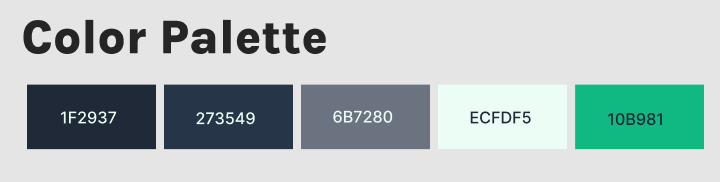
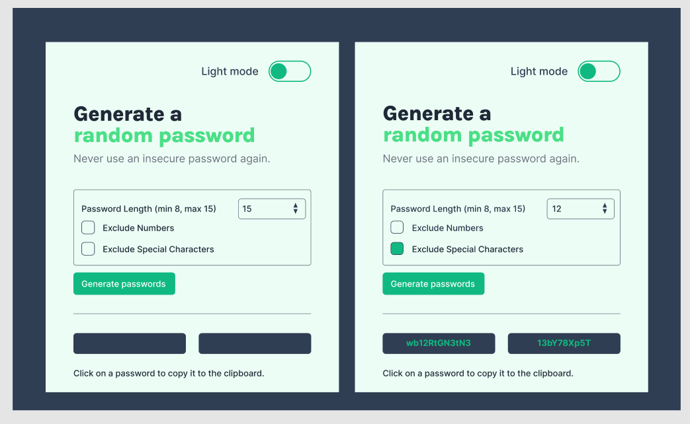
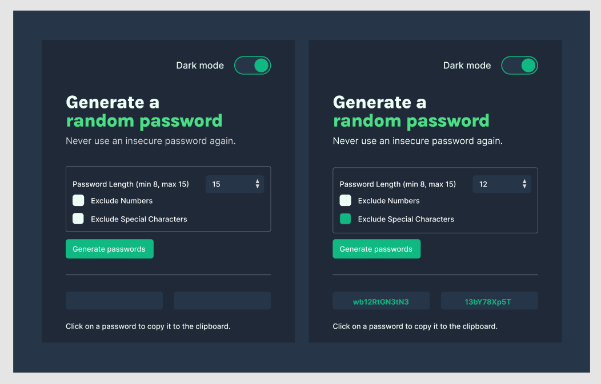
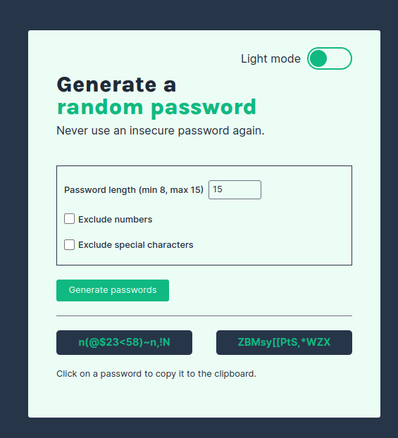
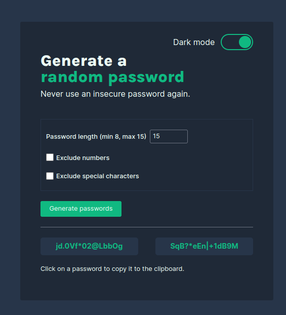
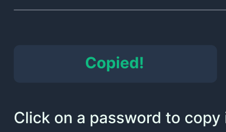

# Random Password Generator

<kbd>HTML</kbd> &middot; <kbd>CSS</kbd> &middot; <kbd>JS</kbd>

## Learning Objectives

1. Figma design
2. Use Figma design to create password generator
3. Update password generator functionality

Advanced:
- Set password length
- Add "copy-on-click"
- Toggle "symbols" and "numbers" on/off

Bonus:
* Toggle light/dark mode

### Figma design

Color palette

Light mode design (unpopulated and populated)

Dark mode design (unpopulated and populated)

View [Figma design](https://www.figma.com/design/AdUXfMotzsXPAE2MZ17qIF/Random-Password-Generator?node-id=0%3A1&t=6kyDcbhF1EwsH4De-1)

### Final webpage

The page is complete with password generation functionality, parameter tweaking, password copy and color switch features.

Light mode page view with passwords generated.

Dark mode page view with passwords generated.

You can interact with the page [here](https://jarabi.github.io/password-generator/).

### Set password length

Password length is restricted to between 8 and 15 numbers. The default value is 15. The user can select password length, however, if the value falls outside the specified bounds, no passwords will be generated and the input will be in red color. This error state is removed and passwords generated once an acceptable value is entered.

### Click-on-copy

A user can click on generated password to copy it to clipboard. A visual confirmation will display once password is copied.

### Toggle "symbols" and "numbers" on/off

The user has the option to exlude numbers and/or special characters from the generated passwords.